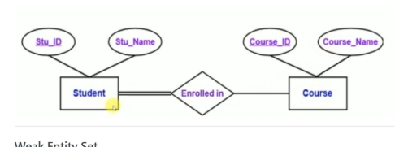
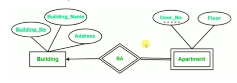
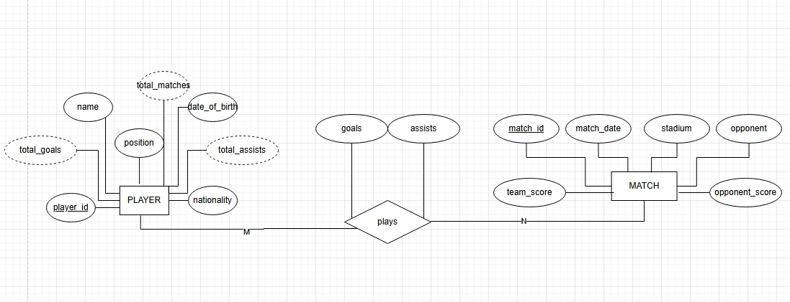

## Question 1: Strong Entity vs Weak Entity

### Strong Entity Set

A strong entity set is represented by a single rectangle in an ER diagram. It contains sufficient attributes to form its own primary key and does not depend on another entity for identification.

In the Student–Course diagram below, both **Student** and **Course** are strong entities. The attributes *Stu_ID* and *Course_ID* are underlined, indicating primary keys. The relationship “Enrolled in” is represented by a single diamond, connecting two strong entities.




------------------------------------------------------------------------

### Weak Entity Set

A weak entity set is represented by a double rectangle. It does not contain enough attributes to form a primary key on its own. Instead, it depends on a strong entity through an identifying relationship.

In the Building–Apartment diagram below, **Apartment** is a weak entity. It is drawn with a double rectangle, and *Door_No* is shown as a partial key (dashed underline). The identifying relationship “BA” is represented with a double diamond. Apartment has total participation in this relationship, meaning it cannot exist without Building.




------------------------------------------------------------------------

### Key Differences

-   Strong entity → single rectangle, own primary key, independent.
-   Weak entity → double rectangle, partial key, dependent on strong entity.
-   Identifying relationship → double diamond.
-   Weak entity has total participation.

## Question 2: E-R Diagram for Scoring Statistics

### (a) Favorite Team Design

The E-R diagram below models the scoring statistics of a favorite sports team.

It stores:

-   Matches played
-   Scores in each match
-   Players participating in each match
-   Individual player scoring statistics per match
-   Summary statistics modeled as derived attributes

### Entities

**PLAYER** - player_id (Primary Key) - name - position - nationality - date_of_birth - total_matches (Derived: COUNT of matches played) - total_goals (Derived: SUM of goals across matches) - total_assists (Derived: SUM of assists across matches)

**MATCH** - match_id (Primary Key) - match_date - stadium - opponent - team_score - opponent_score

### Relationship

**plays** (M:N relationship between PLAYER and MATCH)

Attributes of relationship: - goals (goals scored by player in that match) - assists (assists made by player in that match)

### E-R Diagram



## 

## Question 3(b)

### SQL Query

Write an SQL query using the university schema to find the ID of each student who has never taken a course at the university.\
(No subqueries and no set operations — use an outer join.)

``` sql
SELECT student.ID
FROM student
LEFT OUTER JOIN takes
ON student.ID = takes.ID
WHERE takes.ID IS NULL;
```

### Explanation

This query uses a LEFT OUTER JOIN between the `student` and `takes` tables.

-   The LEFT OUTER JOIN keeps all students.
-   If a student has never taken a course, there will be no matching row in `takes`.
-   When there is no match, the `takes` attributes become NULL.
-   The condition `WHERE takes.ID IS NULL` filters those students.

Therefore, the query returns the ID of each student who has never taken a course.

## Question 3(c)

### SQL Query

Write a query to find the ID of each employee with no manager.\
An employee may either have no entry in the `manages` table or may have a `NULL` manager.\
(Use NATURAL LEFT OUTER JOIN.)

``` sql
SELECT employee.ID
FROM employee
NATURAL LEFT OUTER JOIN manages
WHERE manager_id IS NULL;
```

### Explanation

This query uses a **NATURAL LEFT OUTER JOIN** between the `employee` and `manages` tables.

-   The NATURAL LEFT OUTER JOIN automatically joins the two tables using their common attribute `ID`.
-   The LEFT OUTER JOIN keeps all employees.
-   If an employee has no corresponding row in `manages`, the `manager_id` becomes `NULL`.
-   If the employee has a row but `manager_id` is explicitly `NULL`, it also satisfies the condition.
-   The condition `WHERE manager_id IS NULL` filters employees who have no manager.

Therefore, the query returns the ID of each employee with no manager.
