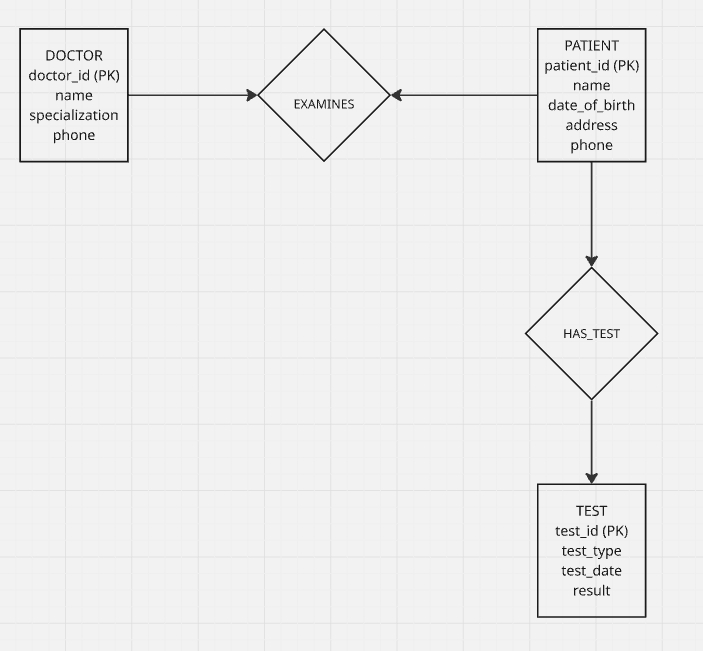

## Question 2: Hospital E-R Diagram

Construct an E-R diagram for a hospital with a set of patients and a set of medical doctors. Associate with each patient a log of the various tests and examinations conducted.

### Entities

The database contains three main entities:

-   **Doctor**
    -   doctor_id (Primary Key)
    -   name
    -   specialization
    -   phone
-   **Patient**
    -   patient_id (Primary Key)
    -   name
    -   date_of_birth
    -   address
    -   phone
-   **Test**
    -   test_id (Primary Key)
    -   test_type
    -   test_date
    -   result

### Relationships

Two relationships are defined:

-   **EXAMINES**
    -   Connects Doctor and Patient
    -   Represents doctors examining patients.
-   **HAS_TEST**
    -   Connects Patient and Test
    -   Represents the log of medical tests conducted for each patient.

### E-R Diagram

The following diagram illustrates the relationship between doctors, patients, and medical tests within the hospital database system.



## Question 3: Why Do We Have Weak Entity Sets?

Although a weak entity set can be converted into a strong entity set by adding its own identifying attributes, weak entity sets are still important because they capture dependency in a more meaningful way. A weak entity does not exist independently; it depends on a related strong entity for its identification and existence.

Using weak entity sets helps represent real-world situations more accurately. For example, a dependent in an employee database cannot exist meaningfully without being linked to an employee. In such a case, forcing the dependent to become a strong entity by assigning it an artificial identifier may work technically, but it hides the natural dependency relationship in the model.

Weak entity sets are therefore useful because they improve conceptual clarity, make relationships easier to understand, and reflect existence dependence directly in the database design.

## \## Question 4: SQL Exercises

### (i) Employee living in the same city as their company

``` sql
SELECT e.ID, e.name
FROM employee AS e
JOIN works AS w ON e.ID = w.ID
JOIN company AS c ON w.company_name = c.company_name
WHERE e.city = c.city;
```

This query retrieves the ID and name of employees who live in the same city as the company where they work. The employee table provides information about employees and their city of residence. The works table links each employee to the company they are employed by, while the company table contains the city where the company is located. By joining these tables and applying the condition `e.city = c.city`, the query selects employees whose city of residence matches the city where their company operates.

### (ii) Employee living on the same street and city as their manager

``` sql
SELECT e.ID, e.name
FROM employee AS e
JOIN manages AS m ON e.ID = m.employee_ID
JOIN employee AS manager ON m.manager_ID = manager.ID
WHERE e.city = manager.city
AND e.street = manager.street;
```

This query finds employees who live in the same city and on the same street as their manager.\
The `manages` table connects employees with their managers, while the employee table is used again to represent the manager. The query then compares the street and city attributes of both the employee and the manager to identify those who share the same address location.

### (iii) Employee earning more than the average salary of their company

``` sql
SELECT e.ID, e.name
FROM employee AS e
JOIN works AS w ON e.ID = w.ID
WHERE w.salary >
(
SELECT AVG(w2.salary)
FROM works AS w2
WHERE w2.company_name = w.company_name
);
```

This query identifies employees whose salary is greater than the average salary of employees working in the same company. The subquery calculates the average salary for each company, and the outer query selects employees whose salary exceeds that value.

### (b) Problem with the SQL Query

``` sql
SELECT name, title
FROM instructor NATURAL JOIN teaches NATURAL JOIN section NATURAL JOIN course
WHERE semester = 'Spring' AND year = 2017;
```

The problem with this query is the use of `NATURAL JOIN`. A natural join automatically joins tables based on columns that share the same name. If multiple tables contain attributes with identical names, the database system may create unintended join conditions, which can lead to incorrect results.

A better approach is to use explicit JOIN conditions where the relationships between tables are clearly specified.
