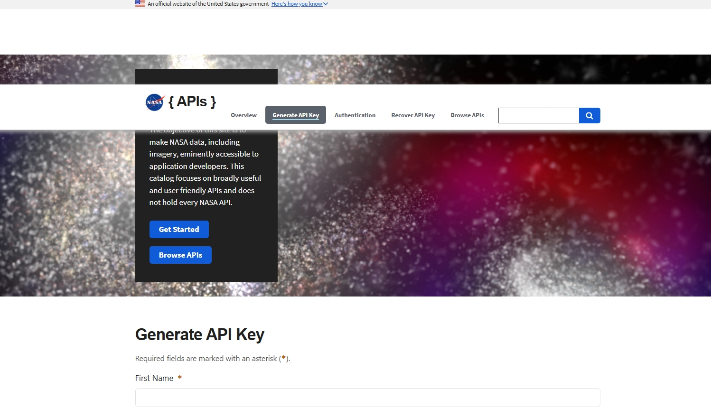
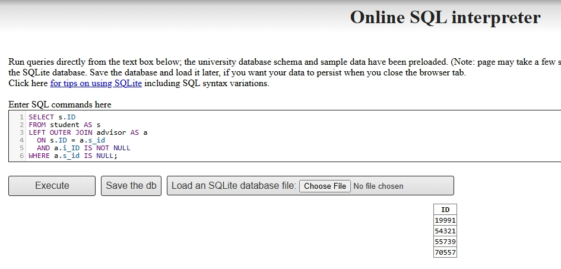
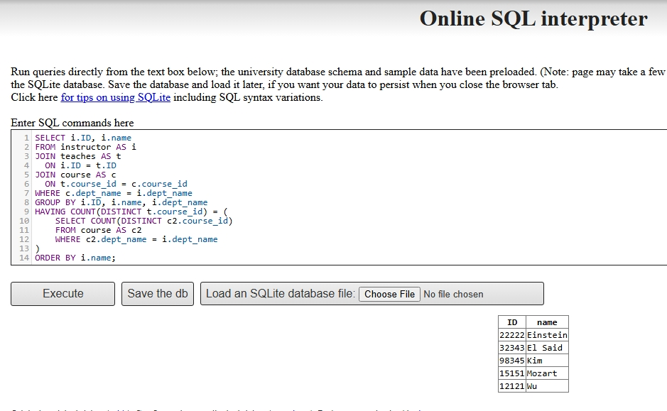
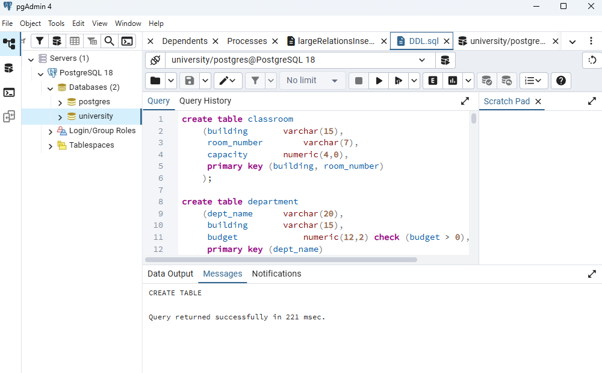
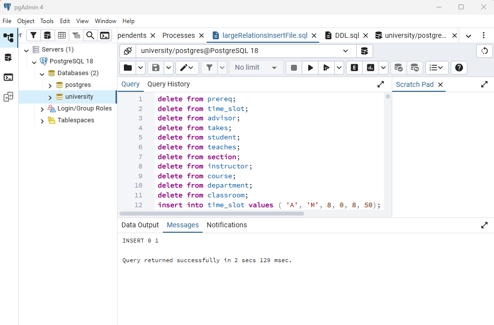
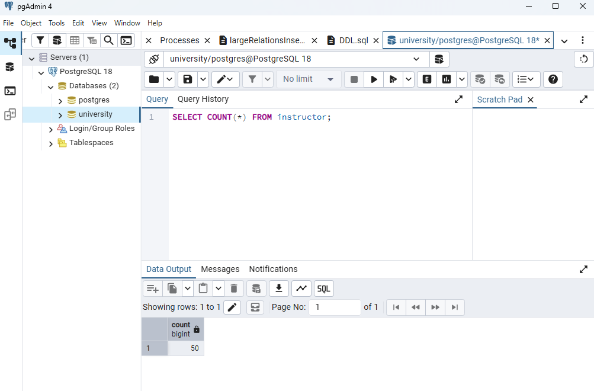

## Question 1: Websites Using JSON and XML

### JSON Website: NASA Open APIs



A strong example of a website that uses JSON is the NASA Open APIs website. NASA presents the site as a public API portal designed to make NASA data accessible to application developers. This means users and developers can request structured data directly from NASA’s system through web APIs.

The structure and composition of JSON on the NASA website are lightweight and hierarchical. JSON organizes information using key-value pairs, arrays, and nested objects. This makes the format easy to read, easy to process, and well suited for web and mobile applications.

The technologies and methods used here include HTTP requests, API-based web services, API keys for controlled access, and JSON serialization for data exchange. This is a modern web-database method because the database is queried programmatically and the results are returned in a machine-readable format.

### XML Website: European Central Bank Data Portal


A strong example of a website that uses XML is the European Central Bank Data Portal. The ECB provides structured economic and exchange-rate data through formats such as XML and SDMX-ML, which are commonly used for formal statistical data exchange.

The structure and composition of XML are more tag-based and schema-driven than JSON. XML uses nested elements and defined markup to organize data in a highly structured way. This makes it useful for institutional systems where data consistency, validation, and interoperability are very important.

The technologies and methods used here include structured XML publishing, standards-based statistical data exchange, and web-based data delivery through official institutional data systems. This makes the ECB site a strong example of XML being used in formal web database environments.

## Question 2: SQL Exercise

### (i) Query using no subqueries and no set operations

The given query is:

``` sql
SELECT ID
FROM student
EXCEPT
SELECT s_id
FROM advisor
WHERE i_ID IS NOT NULL;
```

A correct equivalent query using no subqueries and no set operations is:

``` sql
SELECT s.ID
FROM student AS s
LEFT OUTER JOIN advisor AS a
  ON s.ID = a.s_id
  AND a.i_ID IS NOT NULL
WHERE a.s_id IS NULL;
```

### Query Result



### (ii) Instructors who teach every course in their department

``` sql
SELECT i.ID, i.name
FROM instructor AS i
JOIN teaches AS t
  ON i.ID = t.ID
JOIN course AS c
  ON t.course_id = c.course_id
WHERE c.dept_name = i.dept_name
GROUP BY i.ID, i.name, i.dept_name
HAVING COUNT(DISTINCT t.course_id) = (
    SELECT COUNT(DISTINCT c2.course_id)
    FROM course AS c2
    WHERE c2.dept_name = i.dept_name
)
ORDER BY i.name;
```

### Query Result



## Question 3: R and PostgreSQL

### (a) Importing the full database into PostgreSQL

For this part, I first created a new PostgreSQL database named `university` in pgAdmin. After creating the database, I loaded the `DDL.sql` file, which created the university schema and all required tables. I then loaded the `largeRelationsInsertFile.sql` file, which inserted the large dataset into the tables. To confirm that the import was successful, I ran a test query on the `instructor` table and verified that the data had been loaded correctly.

### Loading and Execution of the DDL and Large Relations Files





### \### Verifying Imported Data 

\`\`\`sql\
SELECT COUNT(\*) FROM instructor;



### (b) Running `RPostgres01.R`

After importing the database into PostgreSQL, I ran the R script to connect RStudio to the `university` database and execute sample queries.

### Load Required Packages

``` r
library(RPostgres)
library(DBI)
library(odbc)
```

### Connect to PostgreSQL

``` r
con <- dbConnect(
  RPostgres::Postgres(),
  dbname   = "university",
  host     = "localhost",
  port     = 5432,
  user     = "postgres",
  password = "********"
)
```

The connection was successful.

### Query 1: Retrieve the Instructor Table

``` r
instructor_data <- dbGetQuery(con, "SELECT * FROM instructor")
head(instructor_data)
```

Output:

``` r
     id           name   dept_name    salary
1 63395       McKinnon Cybernetics  94333.99
2 78699          Pingr  Statistics  59303.62
3 96895           Mird   Marketing 119921.41
4  4233            Luo     English  88791.45
5  4034         Murata   Athletics  61387.56
6 50885 Konstantinides   Languages  32570.50
```

### Query 2: Retrieve Computer Science Instructors with Salary Above 60000

``` r
comp_sci_instructors <- dbGetQuery(
  con,
  "SELECT * FROM instructor 
   WHERE dept_name = 'Comp. Sci.' AND salary > 60000;"
)
comp_sci_instructors
```

Output:

``` r
     id     name  dept_name    salary
1 34175    Bondi Comp. Sci. 115469.11
2  3335 Bourrier Comp. Sci.  80797.83
```

### Query 3: Retrieve Students with Total Credits Greater Than or Equal to 50

``` r
student_data <- dbGetQuery(con, "SELECT * FROM student WHERE tot_cred >= 50")
head(student_data)
```

Output:

``` r
     id       name  dept_name tot_cred
1 79352      Rumat    Finance      100
2 76672     Miliko Statistics      116
3 14182 Moszkowski Civil Eng.       73
4 44985     Prieto    Biology       91
5 44271    Sowerby    English      108
6 40897    Coppens       Math       58
```

### Export the Instructor Table to CSV

``` r
write.csv(instructor_data, file = "instructor_export.csv", row.names = FALSE)
```
