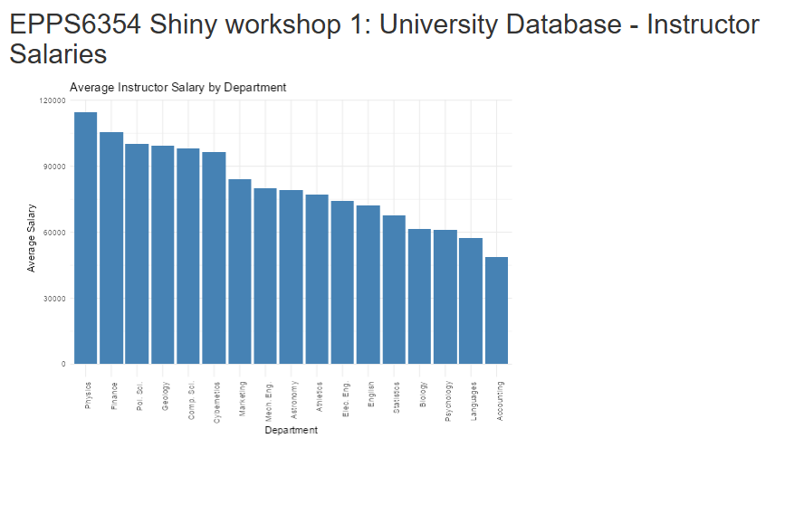
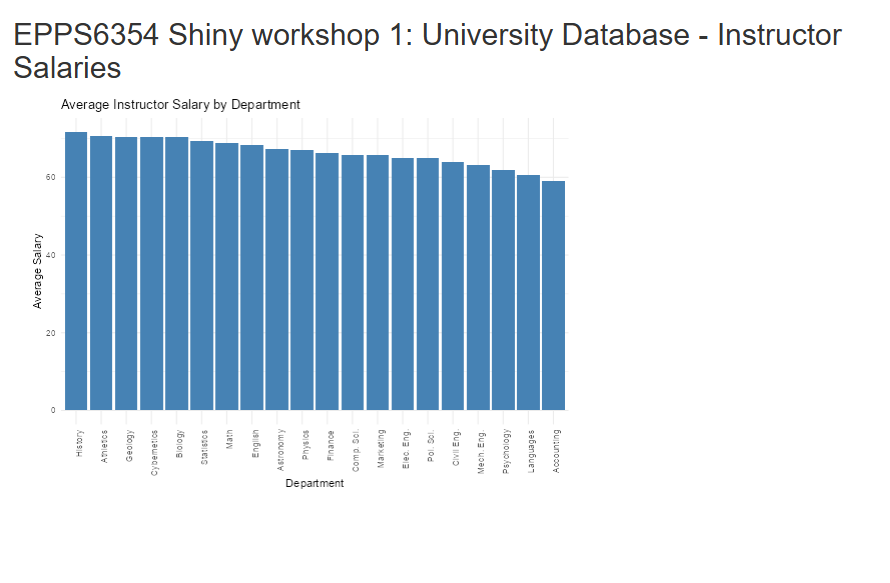
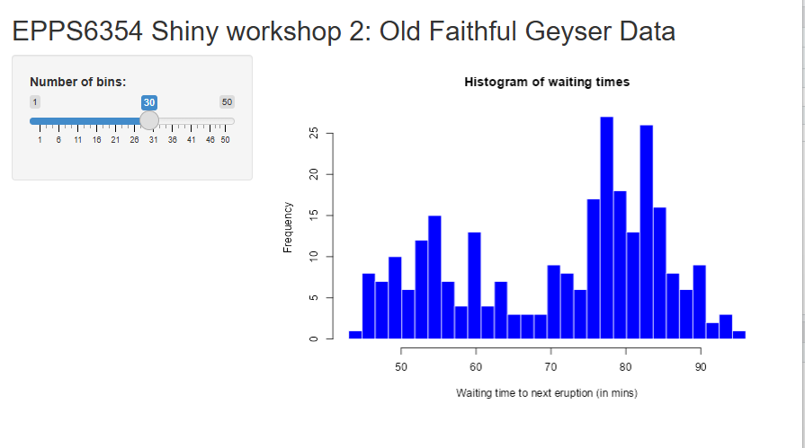
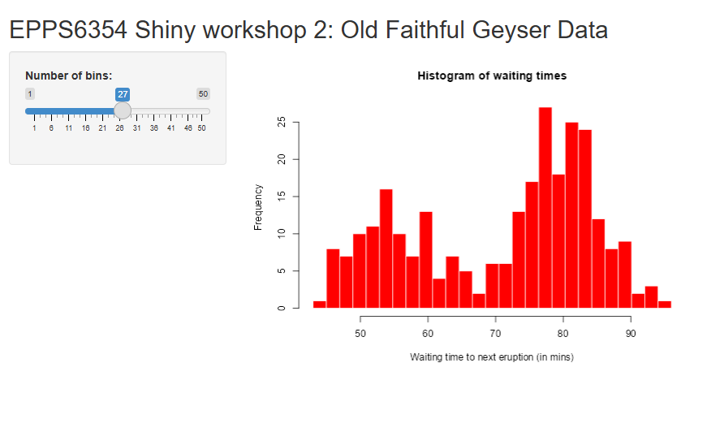

## Assignment 7: AI Exercise

### Shiny App 1: University Database - Instructor Salaries

For the first Shiny application, I ran the `app.R` file in the `Lab/R/Shiny/1 Teams` folder and entered my PostgreSQL password so the application could connect to my local `university` database. The app successfully displayed average instructor salary by department.

### Change 1: Sort Salary from High to Low

To change the salary sorting from high to low, I modified the `ggplot()` line from:

``` r
ggplot(data, aes(x = reorder(dept_name, avg_salary), y = avg_salary)) +
```

to:

``` r
ggplot(data, aes(x = reorder(dept_name, -avg_salary), y = avg_salary)) +
```

### Result: Salary Sorted High to Low


### Change 2: Try Another Variable in Another Table

I then modified the query to use the `student` table and calculate the average total credits by department instead of average instructor salary.

The query was changed from:

``` r
query <- "SELECT dept_name, AVG(salary) AS avg_salary 
          FROM instructor 
          GROUP BY dept_name;"
```

to:

``` r
query <- "SELECT dept_name, AVG(tot_cred) AS avg_salary
          FROM student
          GROUP BY dept_name;"
```

### 



### Updated App Code for Student Table

``` r
instructor_data <- reactive({
  query <- "SELECT dept_name, AVG(tot_cred) AS avg_salary
            FROM student
            GROUP BY dept_name;"
  dbGetQuery(con, query)
})
```

### Result: Average Total Credits by Department



## Shiny App 2: Old Faithful Geyser Data

For the second Shiny application, I ran the `app.R` file in the `R/Shiny/2 Teams` folder and changed the histogram color.

### Original Histogram Code

``` r
hist(x, breaks = bins, col = "blue", border = "white",
     xlab = "Waiting time to next eruption (in mins)",
     main = "Histogram of waiting times")
```

### 



### Updated Histogram Code

``` r
hist(x, breaks = bins, col = "red", border = "white",
     xlab = "Waiting time to next eruption (in mins)",
     main = "Histogram of waiting times")
```

### Result: Histogram with Changed Color



## Conclusion

In this assignment, I successfully ran both Shiny applications. In the first app, I connected to my local PostgreSQL database, changed the bar chart sorting from low-to-high to high-to-low, and then modified the app to use another variable from another table. In the second app, I changed the histogram color from blue to red. These changes demonstrate how Shiny applications can be customized both in terms of data source and visual presentation.
