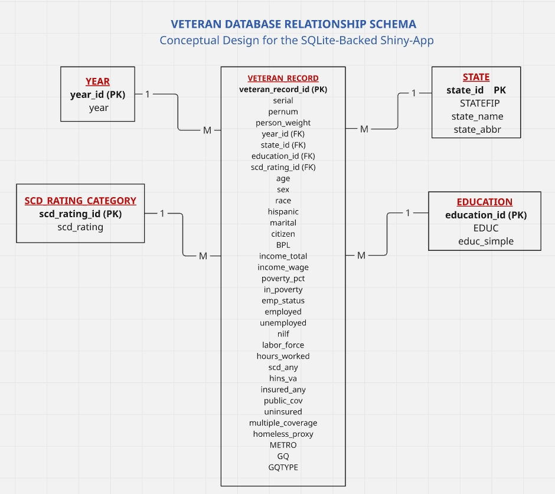

## Title

### Design and Implementation of a Database-Driven SQLite Shiny-App for the Analysis of U.S. Veteran Outcomes

**Alfa Victor Lugard**\
University of Texas at Dallas\
EPPS 6354: Information Management / Database Systems Project

------------------------------------------------------------------------

## Project Overview

This project develops a database-driven Shiny dashboard for analyzing U.S. veteran outcomes using a SQLite backend. The goal was to move beyond a flat-file workflow and build a complete information-management pipeline that connects data, database structure, SQL querying, application design, and live deployment.

The system was designed to support interactive exploration of veteran demographics, labor-force outcomes, poverty, disability, insurance coverage, and state-level variation. The final product was deployed online as a working Shiny application.

------------------------------------------------------------------------

## Research Motivation

Veteran outcomes are multidimensional and cannot be fully understood through static tables alone. Variables such as disability, poverty, employment, labor-force participation, and insurance status interact in meaningful ways and often vary across states and years.

An interactive dashboard allows users to move from raw records to summary indicators, state rankings, and map-based comparisons in a more flexible and policy-relevant way.

------------------------------------------------------------------------

## Data Collection

The data for this study were drawn from the **Integrated Public Use Microdata Series (IPUMS USA)** version of the **American Community Survey (ACS)** and cover the years **2019 to 2024**. The working dataset was constructed as a veteran-only file from the ACS microdata and contains more than **1.1 million veteran observations**, making it suitable for large-scale descriptive and multivariate analysis.

------------------------------------------------------------------------

## Data-to-System Pipeline

### DATA -\> DATABASE -\> APPLICATION -\> WEBSERVER

The project followed a structured information systems workflow. First, the cleaned veteran-level ACS/IPUMS data were stored as a working file. Second, the file was converted into a SQLite database. Third, the database was connected to a Shiny application through SQL queries. Finally, the application was deployed online through shinyapps.io.

This pipeline ensured that the dashboard functioned as a real database-backed application rather than a static visualization page.

------------------------------------------------------------------------

## Database Design

The database was designed around a central observation-level table called **VETERAN_RECORD**. This table represents one veteran record and stores most demographic, labor, income, insurance, disability, and housing variables as attributes of the observation.

A smaller set of lookup tables was used to structure the data more clearly. These include **YEAR**, **STATE**, **EDUCATION_CATEGORY**, and **SCD_RATING_CATEGORY**. This design is more defensible than splitting every variable group into separate parent tables.

------------------------------------------------------------------------

## Recommended Tables

### Main Tables in the Design

-   **YEAR**
-   **STATE**
-   **EDUCATION_CATEGORY**
-   **SCD_RATING_CATEGORY**
-   **VETERAN_RECORD**

This structure reflects a more realistic conceptual schema for the SQLite-backed Shiny app.

------------------------------------------------------------------------

## Relationship Schema

## Application Development

The application was developed in **R Shiny** and connected directly to the SQLite database. SQL queries were used to retrieve filtered and aggregated data for display in tables, state rankings, and visual summaries.

The dashboard was designed with multiple tabs so that users could move across overview statistics, demographic summaries, state analysis, and raw data views. This made the application useful for both demonstration and exploratory analysis.

------------------------------------------------------------------------

## Main Dashboard Features

The final Shiny dashboard includes:

-   interactive filtering by year, sex, race, and disability category\
-   state-level rankings\
-   state-level map visualization\
-   descriptive summaries of veteran outcomes\
-   raw data table output\
-   database-backed querying through SQLite and SQL

These features make the dashboard both a technical database application and a policy-relevant analytical tool.

------------------------------------------------------------------------

## Data Accuracy Issue and Improvement

One important issue identified during development was the risk of inconsistency between the values displayed on the state map and the values shown in the ranking table. This created the appearance of data mismatch, even though the problem came from display logic rather than fabricated data.

The solution was to make both the map and ranking table rely on the exact same reactive summary object and the same rounding rules. This improved the analytical credibility of the application and ensured consistency in the displayed values.

------------------------------------------------------------------------

## Analytical Value

The dashboard makes it possible to examine how veterans differ across multiple dimensions of well-being, including disability, poverty, employment, and insurance coverage. It also allows state-based comparisons that can reveal geographic variation in veteran outcomes.

This is especially useful for policy-oriented analysis because it provides a flexible way to move between national summaries, subgroup filters, and geographic patterns in one system.

------------------------------------------------------------------------

## Strengths of the Project

The project has several strengths. It demonstrates a complete database application workflow, integrates SQL querying with interactive visualization, and uses a live deployed Shiny app rather than a local-only prototype.

It also improves transparency by combining summary views with direct access to the underlying records. This helps users understand that the visual outputs are grounded in a structured and queryable database system.

------------------------------------------------------------------------

## Limitations

The dashboard is primarily descriptive and exploratory. It can identify patterns in veteran outcomes, but it does not by itself establish causal relationships. In addition, the deployed application still relies on a denormalized SQLite implementation for practical reasons, even though the conceptual schema is more structured.

Some map readability issues also remain challenging, especially for smaller states. Even so, the project provides a strong foundation for future refinement.

------------------------------------------------------------------------

## References

IPUMS USA. (2025). *IPUMS USA: American Community Survey microdata*.

Posit. (2025). *Shiny: Web application framework for R*.

R Core Team. (2025). *R: A language and environment for statistical computing*.

SQLite Development Team. (2025). *SQLite documentation*.

U.S. Census Bureau. (2025). *American Community Survey documentation*.
